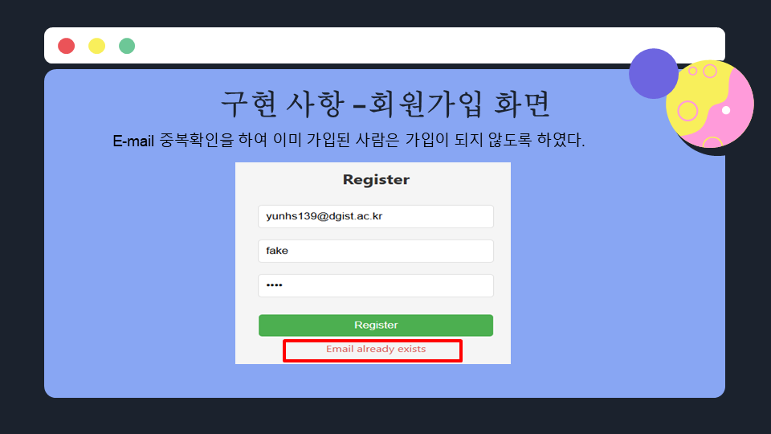

# Bulletin Board Term Project

## 개요
이 프로젝트는 온라인 게시판 시스템을 구축하는 것을 목표로 합니다. 사용자는 게시글을 작성하고 수정하며, 댓글을 남길 수 있습니다. 또한, 파일 첨부 기능도 지원합니다.

## 주요 기능
- **회원 관리**: 사용자 등록, 로그인, 로그아웃
- **게시판 기능**:
  - 게시글 작성, 수정, 삭제
  - 댓글 작성, 수정, 삭제
  - 파일 첨부 기능
- **데이터베이스 연동**

## 기술 스택
### Frontend


### Backend


## ERD (Entity-Relationship Diagram)

- **Member → Board**: 한 회원이 여러 게시글을 작성 (1:N)
- **Member → Comment**: 한 회원이 여러 댓글을 작성 (1:N)
- **Board → Comment**: 한 게시글에 여러 댓글이 작성 (1:N)
- **Board → File**: 한 게시글에 여러 파일이 첨부 (1:N)

## Database


## 설치 및 실행 방법

### Backend 실행
```bash
python Connection.py
```
_(사용자 포트 및 비밀번호 설정 필요)_

### Frontend 실행
```bash
npm install react-scripts --save
npm start
```
_(Git Bash 사용 추천)_

## 구현 화면





